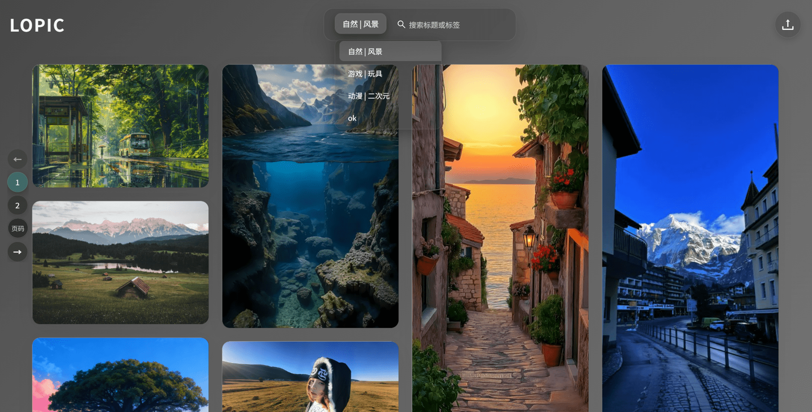
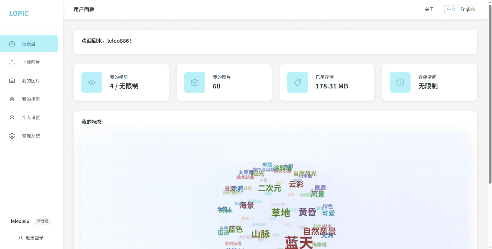

# Lopic

一个图床画廊管理系统，支持图片上传、管理和画廊展示。
A system for managing image galleries, supporting image uploads, management, and gallery display.

## 界面预览 Preview





## 存储支持 Storage Support
- 💾 **本地存储** - **Local Storage**
- ☁️ **WebDAV 存储** - **WebDAV Storage**

## Docker 部署 Docker Deployment

```bash
# 拉取最新镜像 pull latest image
docker pull leleo886/lopic:latest

# 运行容器 run container
docker run -d -p 6060:6060 -v lopic_data:/app/data leleo886/lopic:latest

# 或使用 docker-compose or run with docker-compose
docker-compose up -d
```

## 其他平台部署 Other Platform Deployment

从 [Release 页面](https://github.com/leleo886/lopic/releases) 下载对应平台的可执行文件。
Download the executable file for your platform from the [Release page](https://github.com/leleo886/lopic/releases).

输入 `./lopic --serve` 启动服务。
Start the service by running `./lopic --serve`

会在当前目录生成 `configs/config.yaml` 文件，可以自定义配置。
Generate a `configs/config.yaml` file in the current directory. You can customize the configuration as needed.

或者提前准备好 `config.yaml` 文件，然后输入 `./lopic --serve --config=config.yaml` 启动服务。
Alternatively, if you have a `config.yaml` file ready, you can start the service by running `./lopic --serve --config=config.yaml`

输入 `./lopic --resetpwd=your-password` 重置密码。
Reset the password by running `./lopic --resetpwd=your-password`

## 未来计划 Future Plans
- 支持视频文件 Support Video Files
- 增加更多存储选项 Add More Storage Options
- 支持文件扫描入库 Support File Scan Ingestion
- 支持存储转移 Support Storage Transfer
